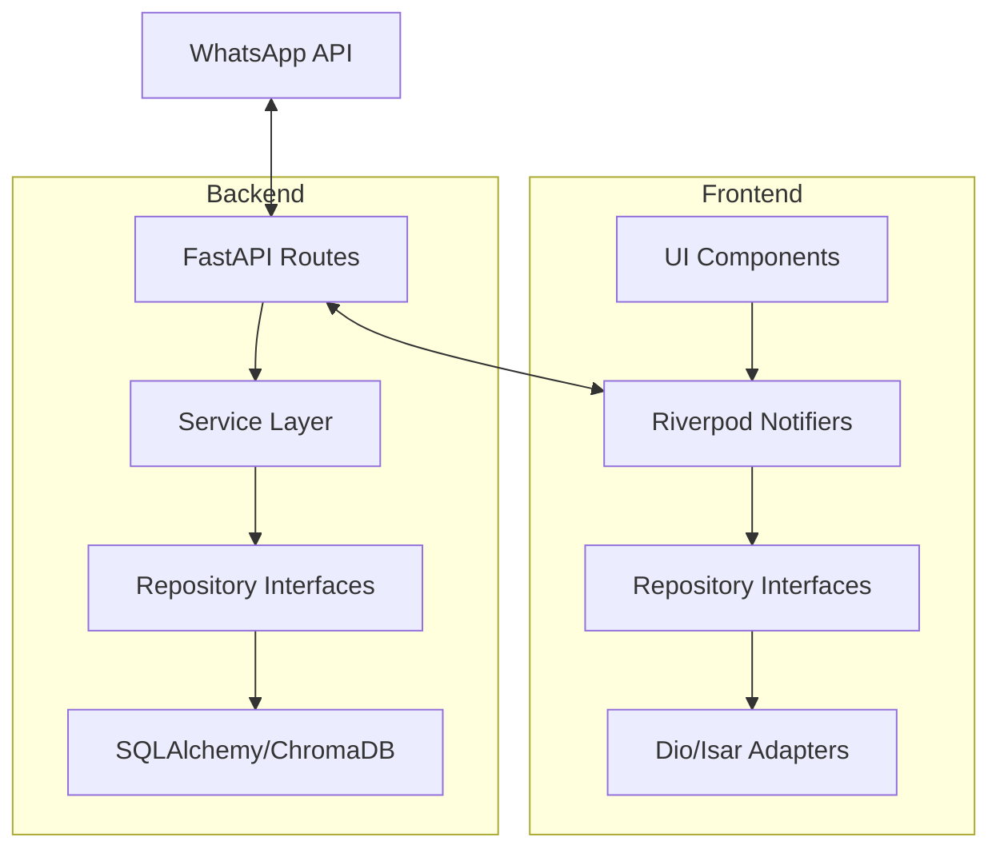

# Cadife Smart Travel 🌍✈️

<p align="center">
  
</p>

<p align="center">
  <strong>Assistente Inteligente de Atendimento Turístico com IA (RAG) e Gestão Omni-channel.</strong>
</p>

<p align="center">
  
  
  
  
  
</p>

---

## 📖 Sobre o Projeto

O **Cadife Smart Travel** é uma plataforma completa para agências de viagens que desejam automatizar o primeiro atendimento e oferecer uma experiência premium aos seus clientes. Utilizando Inteligência Artificial de última geração (RAG - Retrieval-Augmented Generation), o sistema qualifica leads via WhatsApp, gera briefings automáticos e fornece um dashboard robusto para os consultores gerenciarem propostas e agendamentos.

### ✨ Diferenciais
- **🤖 IA AYA:** Assistente virtual inteligente que entende o contexto das viagens e qualifica leads automaticamente.
- **📱 App Mobile Dual-Mode:** Uma interface elegante para consultores (gestão) e outra para clientes (acompanhamento).
- **🛡️ Segurança de Dados:** Criptografia de PII (Personal Identifiable Information) e arquitetura resiliente.
- **⚡ Performance:** Cache com Redis e banco vetorial ChromaDB para respostas rápidas da IA.

---

## 🛠️ Stack Tecnológica

### Frontend (App Mobile)
- **Framework:** Flutter (Android/iOS/Web)
- **Gerenciamento de Estado:** Riverpod (AsyncNotifier)
- **UI System:** Custom Shadcn UI inspired components
- **Local Database:** Isar (NoSQL de alta performance)
- **Navegação:** GoRouter

### Backend (API & Worker)
- **Linguagem:** Python 3.11+
- **Framework:** FastAPI
- **ORM:** SQLAlchemy + Alembic (Migrations)
- **Task Queue:** Background tasks para processamento de IA
- **Segurança:** JWT, Fernet Encryption, Argon2

### Infraestrutura & IA
- **Banco de Dados:** PostgreSQL 16
- **Cache:** Redis
- **Vetor DB:** ChromaDB (RAG)
- **LLM:** OpenAI GPT-4 / LangChain
- **Integração:** WhatsApp Business Cloud API

---

## 🏢 Módulos do Sistema

| Módulo | Descrição | Principais Funcionalidades |
| :--- | :--- | :--- |
| **Agência** | Painel do Consultor | Gestão de Leads, CRM, Agendamentos, Criação de Propostas. |
| **Cliente** | Companion de Viagem | Status da viagem, Documentos, Histórico de Interações, Chat com IA. |
| **Smart Agent** | Motor de IA (AYA) | Captura de leads via WhatsApp, RAG sobre destinos, Scoring de leads. |

---

## 📸 Visual do Projeto

<table align="center">
  <tr>
    <td align="center"><strong>Dashboard da Agência</strong></td>
    <td align="center"><strong>App do Cliente</strong></td>
  </tr>
  <tr>
    <td></td>
    <td></td>
  </tr>
</table>

---

## 🏗️ Arquitetura

O projeto utiliza **Clean Architecture** (Ports & Adapters) para garantir testabilidade e independência de frameworks.



---

## 🌍 Multi-Environment Configuration

O app utiliza **Flutter Flavors** para separar as configurações de desenvolvimento, homologação (staging) e produção.

### Ambientes Disponíveis

| Ambiente | API URL | Firebase Project | App ID | App Name |
| :--- | :--- | :--- | :--- | :--- |
| **Development** | `http://localhost:4000` | `cadife-dev-123` | `com.cadife.tour.dev` | Cadife Dev |
| **Staging** | `https://staging-api.cadife.com` | `cadife-staging-456` | `com.cadife.tour.staging` | Cadife Staging |
| **Production** | `https://api.cadife.com` | `cadife-prod-789` | `com.cadife.tour` | Cadife |

### Comandos de Execução (Frontend)

Os comandos devem ser executados dentro do diretório `frontend_flutter/`:

```bash
# Executar em Desenvolvimento
make run-dev

# Executar em Staging
make run-staging

# Executar em Produção
make run-prod

# Build APK para Staging
make build-staging
```

### Configuração de Desenvolvimento Local (ngrok)

Para apontar o app mobile para seu backend local:

1. Inicie o backend local (`uvicorn` ou `dev.sh`).
2. Inicie o ngrok: `ngrok http 4000`.
3. Atualize o `apiBaseUrl` em `lib/config/app_config.dart` (static const dev).

---

## 🚀 Como Executar

### Pré-requisitos
- Docker & Docker Compose
- Flutter SDK (versão estável)
- Chaves de API (OpenAI, WhatsApp Business)

### Backend (Docker)
```bash
# 1. Configure as variáveis de ambiente
cp backend/.env.example backend/.env

# 2. Suba a infraestrutura
docker compose -f docker/docker-compose.yml up --build -d
```

### Frontend (Flutter)
```bash
cd frontend_flutter
flutter pub get
flutter run
```

---

## 📈 Status Atual & Roadmap

O projeto passou por uma fase intensa de refatoração e agora encontra-se em estado **Estável** para desenvolvimento de novas features.

- [x] Unificação da Camada de Autenticação
- [x] Implementação do CRM de Leads (Agency)
- [x] Integração completa com LangChain/RAG
- [x] Refatoração para Clean Architecture no Flutter
- [ ] Implementação total da Timeline de Viagem (Client)
- [ ] Suite de Testes End-to-End

> [!NOTE]
> Para detalhes técnicos sobre bloqueadores antigos e o histórico de correções, consulte [docs/STATUS_E_ROADMAP.md](./docs/STATUS_E_ROADMAP.md).

---

<p align="center">
  Desenvolvido com ❤️ pela equipe <strong>Cadife Smart Travel</strong>.
</p>