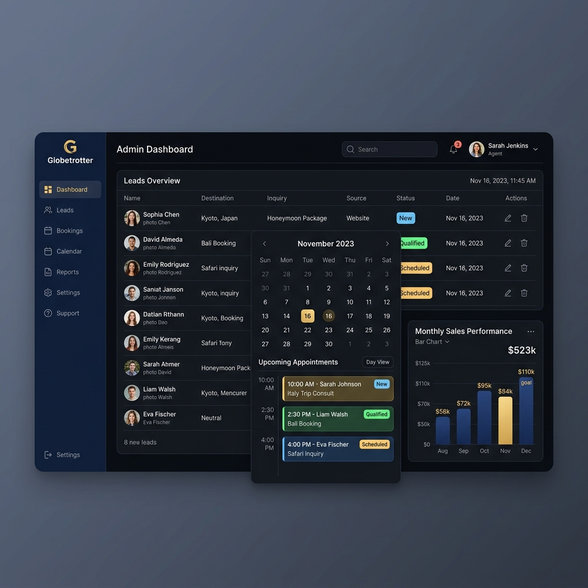
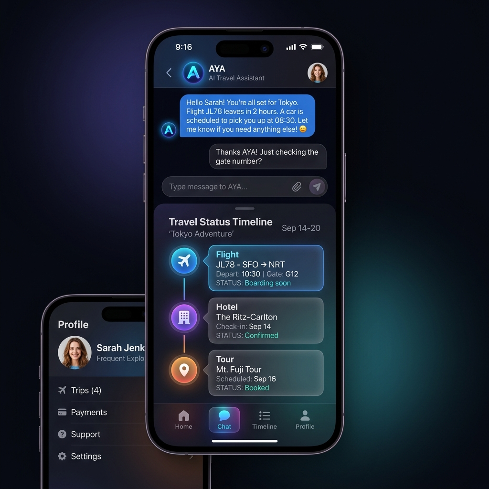
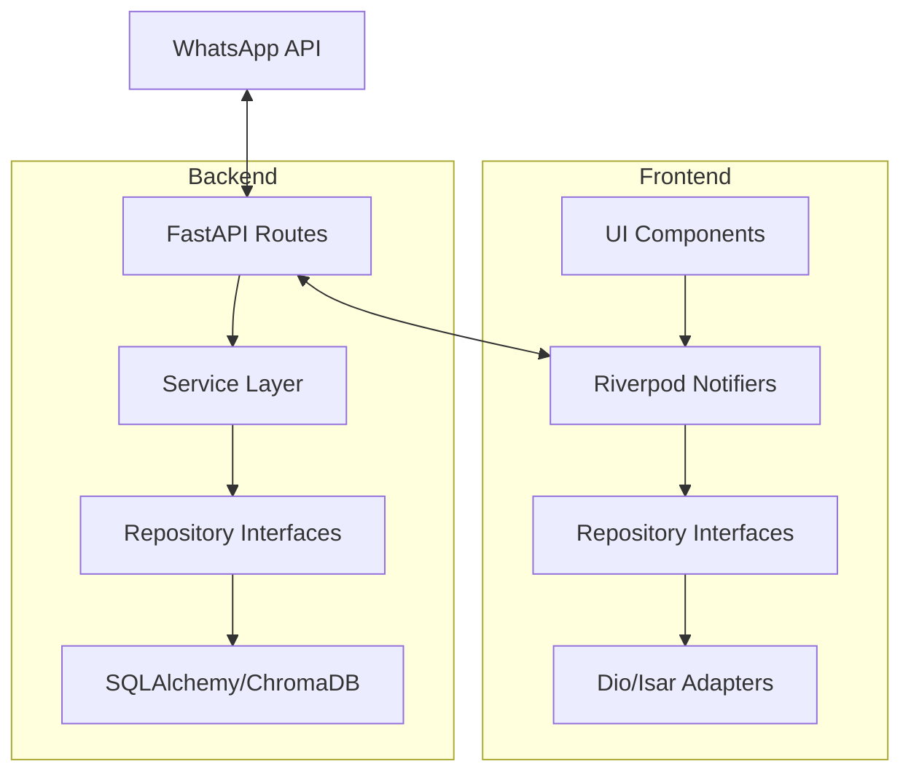

# Cadife Smart Travel 🌍✈️

<p align="center">
  
</p>

<p align="center">
  <strong>Assistente Inteligente de Atendimento Turístico com IA (RAG) e Gestão Omni-channel.</strong>
</p>

<p align="center">
  
  
  
  
  
</p>

---

## 📖 Sobre o Projeto

O **Cadife Smart Travel** é uma plataforma completa para agências de viagens que desejam automatizar o primeiro atendimento e oferecer uma experiência premium aos seus clientes. Utilizando Inteligência Artificial de última geração (RAG - Retrieval-Augmented Generation), o sistema qualifica leads via WhatsApp, gera briefings automáticos e fornece um dashboard robusto para os consultores gerenciarem propostas e agendamentos.

### ✨ Diferenciais
- **🤖 IA AYA:** Assistente virtual inteligente que entende o contexto das viagens e qualifica leads automaticamente.
- **📱 App Mobile Dual-Mode:** Uma interface elegante para consultores (gestão) e outra para clientes (acompanhamento).
- **🛡️ Segurança de Dados:** Criptografia de PII (Personal Identifiable Information) e arquitetura resiliente.
- **⚡ Performance:** Cache com Redis e banco vetorial ChromaDB para respostas rápidas da IA.

---

## 🛠️ Stack Tecnológica

### Frontend (App Mobile)
- **Framework:** Flutter (Android/iOS/Web)
- **Gerenciamento de Estado:** Riverpod (AsyncNotifier)
- **UI System:** Custom Shadcn UI inspired components
- **Local Database:** Isar (NoSQL de alta performance)
- **Navegação:** GoRouter

### Backend (API & Worker)
- **Linguagem:** Python 3.11+
- **Framework:** FastAPI
- **ORM:** SQLAlchemy + Alembic (Migrations)
- **Task Queue:** Background tasks para processamento de IA
- **Segurança:** JWT, Fernet Encryption, Argon2

### Infraestrutura & IA
- **Banco de Dados:** PostgreSQL 16
- **Cache:** Redis
- **Vetor DB:** ChromaDB (RAG)
- **LLM:** OpenAI GPT-4 / LangChain
- **Integração:** WhatsApp Business Cloud API

---

## 🏢 Módulos do Sistema

| Módulo | Descrição | Principais Funcionalidades |
| :--- | :--- | :--- |
| **Agência** | Painel do Consultor | Gestão de Leads, CRM, Agendamentos, Criação de Propostas. |
| **Cliente** | Companion de Viagem | Status da viagem, Documentos, Histórico de Interações, Chat com IA. |
| **Smart Agent** | Motor de IA (AYA) | Captura de leads via WhatsApp, RAG sobre destinos, Scoring de leads. |

---

## 📸 Visual do Projeto

<table align="center">
  <tr>
    <td align="center"><strong>Dashboard da Agência</strong></td>
    <td align="center"><strong>App do Cliente</strong></td>
  </tr>
  <tr>
    <td></td>
    <td></td>
  </tr>
</table>

---

## 🏗️ Arquitetura

O projeto utiliza **Clean Architecture** (Ports & Adapters) para garantir testabilidade e independência de frameworks.



---

## 🚀 Como Executar

### Pré-requisitos
- Docker & Docker Compose
- Flutter SDK (versão estável)
- Chaves de API (OpenAI, WhatsApp Business)

### Backend (Docker)
```bash
# 1. Configure as variáveis de ambiente
cp backend/.env.example backend/.env

# 2. Suba a infraestrutura
docker compose -f docker/docker-compose.yml up --build -d
```

### Frontend (Flutter)
```bash
cd frontend_flutter
flutter pub get
flutter run
```

---

## 💻 Desenvolvimento Local com ngrok (Webhook WhatsApp)

Esta seção descreve como qualquer membro do time pode subir o ambiente completo de desenvolvimento — banco de dados, cache, API e túnel HTTPS — com **um único comando**, sem configuração manual.

### Por que ngrok?

O WhatsApp Cloud API (Meta) exige que a URL de callback do webhook seja **HTTPS pública**. Durante o desenvolvimento local, o `ngrok` cria um túnel HTTPS que aponta para o servidor FastAPI rodando na sua máquina, eliminando a necessidade de deploy para testar a integração.

### Pré-requisitos

| Ferramenta | Instalação |
| :--- | :--- |
| Docker Engine + Compose v2 | [docs.docker.com/get-docker](https://docs.docker.com/get-docker/) |
| ngrok | [ngrok.com/download](https://ngrok.com/download) |
| Python 3.11+ com virtualenv | `python3 -m venv .venv && source .venv/bin/activate` |
| Dependências do backend | `pip install -r backend/requirements.txt` |

> **Recomendado:** Crie uma conta gratuita em [ngrok.com](https://ngrok.com) para obter um `authtoken`. Sem ele, a sessão do túnel expira em 2 horas.

### Configuração inicial (uma única vez)

```bash
# 1. Copie o template de variáveis de ambiente
cp backend/.env.example backend/.env

# 2. Preencha as variáveis obrigatórias no backend/.env:
#    GEMINI_API_KEY, WHATSAPP_TOKEN, PHONE_NUMBER_ID, VERIFY_TOKEN, JWT_SECRET_KEY
#    (opcional) NGROK_AUTHTOKEN — para sessões sem limite de tempo

# 3. Ative seu virtualenv Python
source .venv/bin/activate   # Linux/macOS
# .venv\Scripts\activate    # Windows

# 4. Instale as dependências do backend
pip install -r backend/requirements.txt
```

### Subindo o ambiente com um único comando

```bash
./dev.sh
```

O script executa automaticamente, em ordem:

1. **Docker Compose** — sobe PostgreSQL, Redis e ChromaDB em background (apenas infraestrutura; o FastAPI **não** roda no Docker durante o dev)
2. **Migrações Alembic** — aplica todas as migrations pendentes no banco
3. **FastAPI** — inicia com `--reload` na porta `8000` (hot-reload a cada mudança no código)
4. **ngrok** — abre um túnel HTTPS público apontando para `localhost:8000`

Ao final da inicialização, você verá um resumo como este no terminal:

```
╔══════════════════════════════════════════════════════════════════╗
║      CADIFE SMART TRAVEL  —  Ambiente Dev Ativo  ✓               ║
╚══════════════════════════════════════════════════════════════════╝

  Endpoints locais:
  ├─ API FastAPI    →  http://localhost:8000
  ├─ Swagger Docs   →  http://localhost:8000/docs
  ├─ PostgreSQL     →  localhost:5433  (cadife / cadife)
  ├─ Redis          →  localhost:6379
  └─ ngrok UI       →  http://localhost:4040

  ┌─ URL pública HTTPS do ngrok: ────────────────────────┐
  │  https://abc123.ngrok-free.app                        │
  │                                                        │
  │  URL do Webhook para o Meta:                           │
  │  https://abc123.ngrok-free.app/webhook/whatsapp       │
  └────────────────────────────────────────────────────────┘
```

Para encerrar todos os processos (FastAPI, ngrok e containers Docker), pressione **Ctrl+C**.

### Tutorial: Registrando o Webhook no Meta for Developers

Após o `./dev.sh` exibir a URL do ngrok, siga estes passos para conectar o WhatsApp ao servidor local:

**Passo 1 — Copiar a URL do Webhook**

Copie a URL exibida no terminal (o script já monta o path correto):
```
https://<id-aleatorio>.ngrok-free.app/webhook/whatsapp
```

Você também pode consultar a URL a qualquer momento acessando o dashboard local do ngrok:
```
http://localhost:4040
```

**Passo 2 — Acessar o painel do Meta**

1. Acesse [developers.facebook.com](https://developers.facebook.com) e faça login.
2. No menu superior, clique em **Meus Apps** e selecione o app do projeto.
3. No menu lateral esquerdo, vá em **WhatsApp → Configuração**.

**Passo 3 — Configurar o Webhook**

Na seção **Webhook**, clique em **Editar** (ou **Configurar**, se for a primeira vez):

| Campo | Valor |
| :--- | :--- |
| **Callback URL** | `https://<id-aleatorio>.ngrok-free.app/webhook/whatsapp` |
| **Verify Token** | O valor de `VERIFY_TOKEN` do seu `backend/.env` |

**Passo 4 — Verificar e Salvar**

Clique em **Verificar e Salvar**. O Meta enviará um `GET` com um `hub.challenge` para a URL cadastrada e, se a API local responder corretamente (o `VERIFY_TOKEN` bater), o webhook será ativado.

**Passo 5 — Assinar os campos (Webhooks Fields)**

Após salvar, role a página até **Campos do Webhook** e ative, no mínimo:
- `messages`
- `message_deliveries`

> **Importante:** A URL do ngrok **muda a cada restart** do `dev.sh` (plano gratuito). Repita o Passo 3 sempre que reiniciar o ambiente. Para uma URL fixa, configure um [domínio estático no ngrok](https://ngrok.com/docs/ngrok-agent/config/#tunnels) e defina `NGROK_DOMAIN` no `backend/.env`.

### Logs em tempo real

```bash
# Log da API FastAPI (com erros de startup, requests, etc.)
tail -f .dev-logs/uvicorn.log

# Log do ngrok (conexões, requests recebidos pelo túnel)
tail -f .dev-logs/ngrok.log
```

---

## 📈 Status Atual & Roadmap

O projeto passou por uma fase intensa de refatoração e agora encontra-se em estado **Estável** para desenvolvimento de novas features.

- [x] Unificação da Camada de Autenticação
- [x] Implementação do CRM de Leads (Agency)
- [x] Integração completa com LangChain/RAG
- [x] Refatoração para Clean Architecture no Flutter
- [ ] Implementação total da Timeline de Viagem (Client)
- [ ] Suite de Testes End-to-End

> [!NOTE]
> Para detalhes técnicos sobre bloqueadores antigos e o histórico de correções, consulte [docs/STATUS_E_ROADMAP.md](./docs/STATUS_E_ROADMAP.md).

---

<p align="center">
  Desenvolvido com ❤️ pela equipe <strong>Cadife Smart Travel</strong>.
</p>