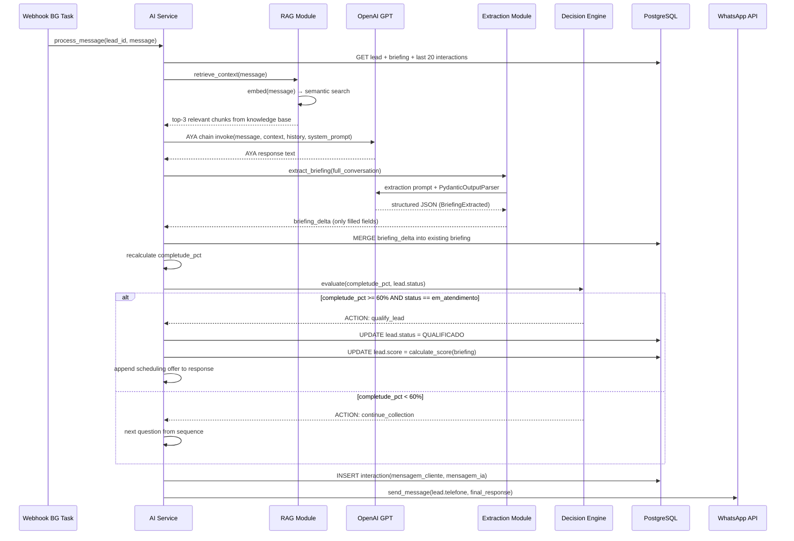

# Design de Arquitetura: Camada de IA / RAG — AYA

## Objetivo do Design

Definir como o assistente AYA é construído com LangChain, como o RAG recupera contexto da base Cadife Tour, como o briefing é extraído de forma estruturada e como o motor de decisão roteia o fluxo de qualificação.

---

## 1. Arquitetura dos Módulos de IA

```
WhatsApp Message
      │
      ▼
┌─────────────────────────────────────────────────────┐
│                  AI Service (AYA)                    │
│                                                      │
│  ┌──────────────┐   ┌──────────────┐   ┌──────────┐ │
│  │  RAG Module  │   │  Extraction  │   │  Decision│ │
│  │  (Retriever) │   │   Module     │   │  Engine  │ │
│  │              │   │  (Parser)    │   │          │ │
│  │ ChromaDB /   │   │ PydanticOut- │   │ score≥60%│ │
│  │ PGVector     │   │ putParser    │   │ → qualify│ │
│  └──────┬───────┘   └──────┬───────┘   └────┬─────┘ │
│         │                  │                │       │
│         └──────────────────┴────────────────┘       │
│                            │                        │
│                    ┌───────▼───────┐                │
│                    │  AYA Chain    │                │
│                    │  (LangChain)  │                │
│                    └───────────────┘                │
└─────────────────────────────────────────────────────┘
      │
      ▼
 Response + Updated Briefing + New Status
```

---

## 2. Diagrama de Fluxo da Chain AYA



---

## 3. Estrutura do System Prompt (AYA)

```python
AYA_SYSTEM_PROMPT = """
Você é AYA, assistente virtual da Cadife Tour — agência especializada em
curadoria personalizada de viagens internacionais.

TOM E PERSONALIDADE:
- Consultiva e próxima: 80% consultor / 20% vendedor
- Linguagem natural, clara, educada e não invasiva
- Faça UMA pergunta por vez — nunca sobrecarregue o cliente
- Use o nome do cliente quando disponível

PROIBIÇÕES ABSOLUTAS (nunca viole):
- Nunca mencione preços, valores, estimativas ou condições de pagamento
- Nunca confirme disponibilidade de voos, hotéis ou passeios
- Nunca feche vendas ou comprometa comercialmente a empresa
- Nunca tome decisões comerciais sem o consultor humano
- Sempre deixe claro que o consultor irá validar as informações

CONTEXTO DA CADIFE TOUR (use apenas o conteúdo abaixo):
{rag_context}

HISTÓRICO DA CONVERSA:
{chat_history}

DADOS JÁ COLETADOS DO BRIEFING:
{briefing_summary}

OBJETIVO DA CONVERSA:
Coletar de forma natural os dados da viagem: destino, datas, nº de pessoas,
perfil da viagem, tipo, preferências, orçamento e passaporte.
Próximo campo a coletar: {next_field}
"""
```

---

## 4. Prompt de Extração de Briefing

```python
EXTRACTION_PROMPT = """
Analise a conversa abaixo e extraia os dados do briefing de viagem.

REGRAS CRÍTICAS:
1. Preencha APENAS campos que o cliente mencionou EXPLICITAMENTE
2. NÃO infira dados — se não foi dito, deixe null
3. Para listas (tipo_viagem, preferencias), inclua todos os itens mencionados
4. Para datas, converta para formato ISO 8601 (YYYY-MM-DD)
5. Para orcamento, mapeie: "barato/econômico" → "baixo", "médio/moderado" → "médio",
   "alto/confortável" → "alto", "luxo/premium" → "premium"

Conversa:
{conversation}

{format_instructions}
"""
```

---

## 5. Schema Pydantic para Extração

```python
from pydantic import BaseModel, Field
from typing import Optional, List
from datetime import date

class BriefingExtracted(BaseModel):
    destino: Optional[str] = Field(None, description="Destino mencionado pelo cliente")
    origem_viagem: Optional[str] = Field(None, description="Cidade/país de origem")
    data_ida: Optional[date] = Field(None, description="Data de partida (ISO 8601)")
    data_volta: Optional[date] = Field(None, description="Data de retorno (ISO 8601)")
    qtd_pessoas: Optional[int] = Field(None, ge=1, description="Número de viajantes")
    perfil: Optional[str] = Field(None, description="casal|família|solo|grupo|amigos")
    tipo_viagem: Optional[List[str]] = Field(None, description="turismo|lazer|aventura|imigração|negócios")
    preferencias: Optional[List[str]] = Field(None, description="frio|calor|praia|cidade|luxo|econômico")
    orcamento: Optional[str] = Field(None, description="baixo|médio|alto|premium")
    tem_passaporte: Optional[bool] = Field(None, description="True se mencionou ter passaporte válido")
    viajou_antes: Optional[bool] = Field(None, description="True se mencionou viagem internacional anterior")
    observacoes: Optional[str] = Field(None, description="Outras informações relevantes livres")
```

---

## 6. Algoritmo de Score de Lead

```python
BRIEFING_FIELDS_WEIGHT = {
    "destino":      20,  # campo mais importante
    "data_ida":     15,
    "qtd_pessoas":  15,
    "orcamento":    15,
    "data_volta":   10,
    "perfil":       10,
    "tipo_viagem":   5,
    "preferencias":  5,
    "tem_passaporte": 5,
}

def calculate_completude(briefing: BriefingExtracted) -> int:
    score = 0
    for field, weight in BRIEFING_FIELDS_WEIGHT.items():
        value = getattr(briefing, field, None)
        if value not in (None, [], ""):
            score += weight
    return min(score, 100)

def assign_lead_score(briefing: BriefingExtracted) -> LeadScore:
    has_destino = bool(briefing.destino)
    has_datas = bool(briefing.data_ida)
    has_pessoas = bool(briefing.qtd_pessoas)
    has_orcamento = bool(briefing.orcamento)

    if has_destino and has_datas and has_pessoas and has_orcamento:
        return LeadScore.quente
    elif has_destino:
        return LeadScore.morno
    else:
        return LeadScore.frio
```

---

## 7. Sequência de Perguntas AYA (Motor de Fluxo)

O motor determina qual campo coletar a seguir com base no que já está preenchido:

```python
COLLECTION_SEQUENCE = [
    ("destino",       "Você já tem um destino em mente, ou posso te ajudar a escolher?"),
    ("data_ida",      "Tem alguma data em mente para a viagem? Ou ainda está avaliando?"),
    ("qtd_pessoas",   "Quantas pessoas vão viajar com você?"),
    ("perfil",        "É uma viagem em família, casal, sozinho ou grupo de amigos?"),
    ("tipo_viagem",   "O que você busca: turismo, lazer, aventura, imigração ou outra coisa?"),
    ("preferencias",  "Prefere clima frio ou quente? Praia ou cidade? Algo mais específico?"),
    ("orcamento",     "Tem uma faixa de investimento em mente? (Apenas para eu te orientar melhor)"),
    ("tem_passaporte","Já possui passaporte válido?"),
    ("viajou_antes",  "Já viajou internacionalmente antes?"),
]

def get_next_field(briefing: BriefingExtracted) -> Optional[tuple[str, str]]:
    for field, question in COLLECTION_SEQUENCE:
        value = getattr(briefing, field, None)
        if value in (None, [], ""):
            return field, question
    return None  # briefing completo
```

---

## 8. Base de Conhecimento RAG (Cadife Tour)

### Documentos a Indexar

| Arquivo | Tipo | Conteúdo | Validação |
|---|---|---|---|
| `identidade_empresa.txt` | Institucional | Missão, valores, diferenciais da Cadife Tour | PO Diego |
| `fluxo_atendimento.txt` | Processo | Etapas de recepção, qualificação, curadoria | PO Diego |
| `faq.txt` | FAQ | Visto, passaporte, seguro viagem, documentação | PO Diego |
| `regras_negocio.txt` | Regras | Horários, prazos, limites de atendimento | PO Diego |
| `destinos.txt` | Produtos | Destinos principais, experiências ofertadas | PO Diego |
| `objecoes.txt` | Vendas | Estratégias para clientes indecisos | PO Diego |
| `argumentacao.txt` | Vendas | Argumentação consultiva e gatilhos de valor | PO Diego |

### Configuração do Vector DB

```python
# Chunking
text_splitter = RecursiveCharacterTextSplitter(
    chunk_size=400,
    chunk_overlap=50,
    separators=["\n\n", "\n", ". ", " ", ""],
)

# Embedding
embeddings = OpenAIEmbeddings(model="text-embedding-3-small")

# Retrieval
retriever = vectorstore.as_retriever(
    search_type="similarity",
    search_kwargs={"k": 3}  # top-3 chunks mais relevantes
)
```

---

## 9. Tratamento de Mensagens de Mídia

```python
MEDIA_FALLBACK = {
    "audio": (
        "Recebi um áudio! Por enquanto consigo responder melhor por texto. "
        "Pode me contar o que precisa por escrito? Estou aqui para ajudar! 😊"
    ),
    "image": (
        "Recebi uma imagem! No momento trabalho melhor com mensagens de texto. "
        "Pode me descrever o que está buscando? Vou adorar te ajudar a planejar!"
    ),
    "document": (
        "Recebi um documento! Nossa equipe dará uma olhada em breve. "
        "Enquanto isso, pode me contar mais sobre a viagem que está planejando?"
    ),
}
```
