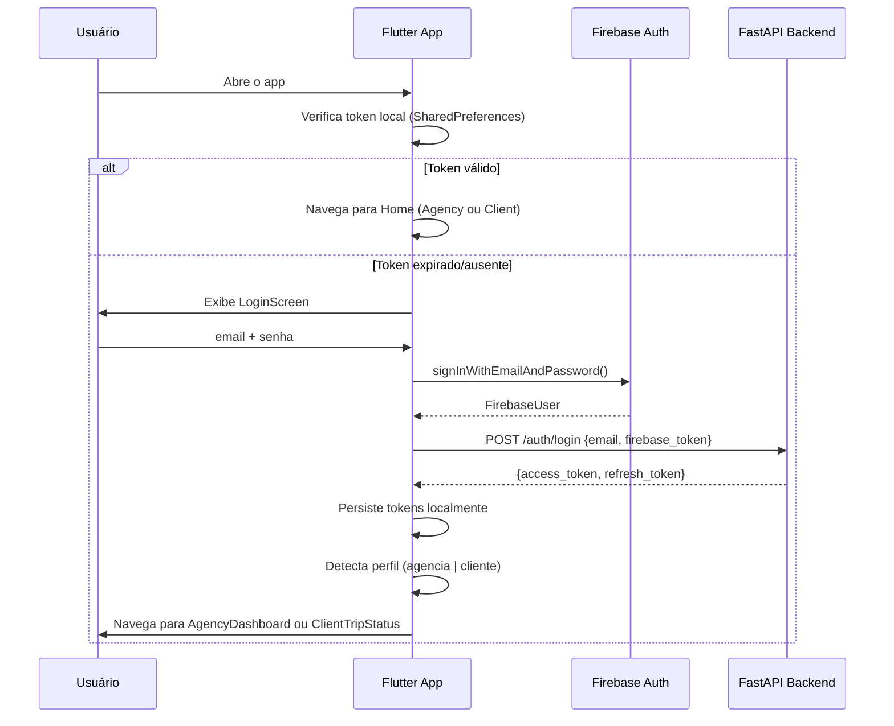

# Design de Arquitetura: Flutter App — Fluxos e Telas

## Objetivo do Design

Definir a estrutura de telas, fluxos de navegação, estados de UI e componentes do App Flutter para os perfis Agência e Cliente da Cadife Tour.

---

## 1. Fluxo de Autenticação



---

## 2. Estrutura de Navegação (GoRouter)

```
/                         → redirect para /auth/login ou /agency/dashboard
/auth/
  /login                  → LoginScreen
/agency/
  /dashboard              → AgencyDashboardScreen
  /leads                  → LeadsListScreen
  /leads/:id              → LeadDetailScreen
  /agenda                 → AgendaScreen
  /proposals/:leadId      → ProposalCreateScreen
/client/
  /status                 → TripStatusScreen
  /interactions           → InteractionsScreen
  /documents              → DocumentsScreen
  /profile                → ProfileScreen
```

**Guards:** rota `/agency/*` exige `perfil == "agencia"`. Rota `/client/*` exige `perfil == "cliente"`. Redirecionamento automático para `/auth/login` se não autenticado.

---

## 3. Perfil Agência

### 3.1 AgencyDashboardScreen

**Estados:** loading → data → error (pull-to-refresh)

```
┌─────────────────────────────────────┐
│  ████ Cadife Tour           🔔 (3)  │  ← AppBar backgroundColor #393532
├─────────────────────────────────────┤
│  Bom dia, Nikolas! ☀️               │
│  Segunda-feira, 02/06/2025          │
├─────────────────────────────────────┤
│  ┌──────────┐ ┌──────────┐          │
│  │ 12 Leads │ │ 4 Novos  │          │  ← KPI Cards (cardBackground #F8F9FA)
│  │  Total   │ │  Hoje    │          │
│  └──────────┘ └──────────┘          │
│  ┌──────────┐ ┌──────────┐          │
│  │ 3 Agend. │ │ 67% Qual.│          │
│  │ Pendentes│ │  Rate    │          │
│  └──────────┘ └──────────┘          │
├─────────────────────────────────────┤
│  LEADS RECENTES                     │
│  ┌───────────────────────────────┐  │
│  │ 🔴 Maria S. — Portugal  NOVO │  │  ← LeadCard (score badge colorido)
│  │    +55 11 99999-9999          │  │
│  └───────────────────────────────┘  │
│  ┌───────────────────────────────┐  │
│  │ 🟡 João P. — França  QUALIF. │  │
│  └───────────────────────────────┘  │
│  Ver todos os leads →               │
└─────────────────────────────────────┘
```

**Providers:** `dashboardStatsProvider`, `recentLeadsProvider`

---

### 3.2 LeadsListScreen

**Estados:** loading → data (lista) → empty → error

```
┌─────────────────────────────────────┐
│  ← Leads                    🔍  ⚙️ │
├─────────────────────────────────────┤
│  🔍 Buscar por nome ou telefone...  │
├─────────────────────────────────────┤
│  Filtros: [Todos ▼] [Score ▼] [Data▼│
├─────────────────────────────────────┤
│  42 leads encontrados               │
│                                     │
│  ┌───────────────────────────────┐  │
│  │ 🔴 QUENTE                     │  │  ← badge successColor #1E8449
│  │ Maria Silva                   │  │
│  │ Portugal • 3 pax • Família    │  │
│  │ QUALIFICADO • 01/06/2025      │  │
│  └───────────────────────────────┘  │
│  ┌───────────────────────────────┐  │
│  │ 🟡 MORNO                      │  │  ← badge warningColor #D35400
│  │ João Pereira                  │  │
│  │ França • ? pax • Solo         │  │
│  │ EM ATENDIMENTO • 31/05/2025   │  │
│  └───────────────────────────────┘  │
│  ↑ Pull-to-refresh                  │
│  ↓ Scroll infinito (paginação)      │
└─────────────────────────────────────┘
```

**Providers:** `leadsNotifierProvider(filters: LeadFilters)`

---

### 3.3 LeadDetailScreen

**Estados:** loading → data → error

```
┌─────────────────────────────────────┐
│  ← Maria Silva        🔴 QUENTE    │
├─────────────────────────────────────┤
│  CONTATO                            │
│  📱 +55 11 99999-9999  [WhatsApp]   │
│  📍 WhatsApp • 01/06/2025           │
├─────────────────────────────────────┤
│  BRIEFING (85% completo)            │
│  ████████████░░  85%                │
│  🗺️  Destino: Portugal              │
│  📅  02/02/2026 → 12/02/2026 (10d) │
│  👥  3 pessoas • Família            │
│  🎒  Turismo + Imigração            │
│  ❄️  Cidade + Cultura               │
│  💰  Orçamento: Médio               │
│  🛂  Passaporte: ✅ Válido          │
│  📝  1ª viagem internacional        │
├─────────────────────────────────────┤
│  STATUS TIMELINE                    │
│  ✅ NOVO       01/06 10:30          │
│  ✅ EM_ATEND.  01/06 10:31          │
│  ✅ QUALIFIC.  01/06 11:45          │
│  ○  AGENDADO                        │
├─────────────────────────────────────┤
│  AÇÕES RÁPIDAS                      │
│  [Agendar] [Criar Proposta] [Nota]  │  ← primaryColor #dd0b0e buttons
├─────────────────────────────────────┤
│  HISTÓRICO (18 mensagens)  [Ver +]  │
│  01/06 10:30 • "Quero viajar para…" │
└─────────────────────────────────────┘
```

**Providers:** `leadDetailProvider(leadId)`, `leadInteractionsProvider(leadId)`

---

### 3.4 AgendaScreen

**Estados:** loading → calendário com slots → error

```
┌─────────────────────────────────────┐
│  ← Agenda               [+ Novo]   │
├─────────────────────────────────────┤
│  < Junho 2025 >                     │
│  Seg Ter Qua Qui Sex                │
│   2   3   4   5   6                 │
│   9  10  11  12  13                 │
│   ● = tem agendamento               │
├─────────────────────────────────────┤
│  Segunda, 02 de Junho               │
│                                     │
│  09:00  Maria Silva   [CONFIRMADO]  │
│  10:00  ─────────────────────────── │  ← slot disponível
│  11:00  João Pereira  [PENDENTE]    │
│  12:00  ─────────────────────────── │
│  13:00  ─────────────────────────── │
│  14:00  Ana Costa     [CONFIRMADO]  │
│  15:00  ─────────────────────────── │
│  16:00  ─────────────────────────── │
└─────────────────────────────────────┘
```

**Regras de negócio validadas na UI antes de enviar ao backend:**
- Apenas Seg–Sex, 09h–16h
- Máx. 6 agendamentos por dia (desabilita slots se atingido)
- Intervalo mínimo 1h (slots bloqueados após agendamento)

---

## 4. Perfil Cliente

### 4.1 TripStatusScreen

```
┌─────────────────────────────────────┐
│  ████ Minha Viagem                  │
├─────────────────────────────────────┤
│                                     │
│  ✈️  Portugal — Família             │
│  02/02/2026 → 12/02/2026            │
│                                     │
│  STATUS ATUAL                       │
│  ╔══════════════════════════╗       │
│  ║  🔵 PROPOSTA ENVIADA     ║       │
│  ╚══════════════════════════╝       │
│                                     │
│  Progresso:                         │
│  ●────●────●────○────○             │
│  Em     Proposta Conf. Emitido      │
│  Análise enviada                    │
│                                     │
│  "Nossa equipe preparou uma proposta│
│   personalizada para você. Confira!" │
│                                     │
│  [Ver Proposta]  [Falar com Agência]│
└─────────────────────────────────────┘
```

### 4.2 TripStatusScreen — Progress Mapping

```dart
enum ClientTripStatus { em_analise, proposta_enviada, confirmado, emitido }

int progressStep(LeadStatus status) => switch (status) {
  LeadStatus.novo         => 0,
  LeadStatus.em_atendimento => 0,
  LeadStatus.qualificado  => 0,
  LeadStatus.agendado     => 1,
  LeadStatus.proposta     => 2,
  LeadStatus.fechado      => 3,
  LeadStatus.perdido      => -1,
};
```

---

## 5. Componentes Reutilizáveis

### LeadScoreBadge
```dart
// Exibição: chip colorido com texto QUENTE/MORNO/FRIO
// Cores: success, warning, textSecondary (ver AppColors)
// Tamanhos: small (lista), medium (detalhe)
```

### LeadStatusChip
```dart
// Chip com cor e label mapeados por LeadStatus
// statusColors: { qualificado: Colors.blue, agendado: Colors.teal, ... }
```

### BriefingProgressBar
```dart
// LinearProgressIndicator com completude_pct / 100
// Cor: primaryColor quando >= 60%, warningColor quando < 60%
```

### EmptyStateWidget
```dart
// Tela de estado vazio reutilizável: ícone + título + subtítulo + CTA opcional
// Usado em: lista de leads vazia, sem documentos, sem agendamentos
```

---

## 6. Notificações Push (FCM → Flutter)

### Fluxo de Recebimento

```dart
// notification_service.dart
class NotificationService {
  Future<void> initialize() async {
    // 1. Pedir permissão (iOS + Android 13+)
    // 2. Obter token FCM e registrar via POST /users/fcm-token
    // 3. Configurar onMessage (foreground) — exibir SnackBar ou InAppNotification
    // 4. Configurar onMessageOpenedApp (background tap) — navegar para lead
    // 5. Configurar onBackgroundMessage (background handler)
  }
}
```

### Payload FCM Esperado (do backend)
```json
{
  "notification": {
    "title": "Novo lead qualificado! 🔴",
    "body": "Portugal • Maria Silva • Orçamento médio"
  },
  "data": {
    "type": "new_lead",
    "lead_id": "uuid",
    "screen": "/agency/leads/uuid"
  }
}
```

### Ação no App ao Receber
- **Foreground:** `SnackBar` com nome do lead + botão "Ver lead" → navega para `LeadDetailScreen`
- **Background/tap:** navega diretamente para `LeadDetailScreen` via `GoRouter`
- **Refresh:** `ref.invalidate(leadsNotifierProvider)` para atualizar a lista
