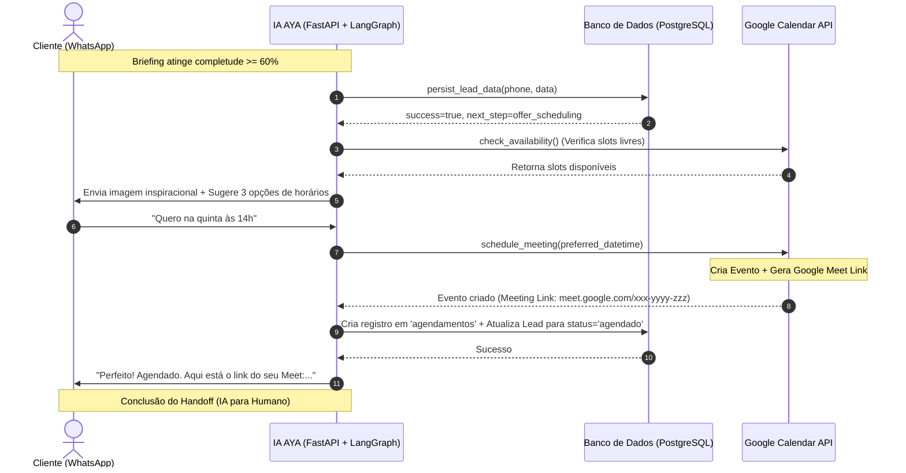

# Guia de Implementação: Integração Google Calendar & Handoff IA-Humano

Este documento apresenta o levantamento técnico detalhado e o plano de implementação passo a passo para integrar a **AYA** (nossa IA de atendimento) ao **Google Calendar**. 

Ao final do fluxo de briefing, a IA será capaz de:
1. **Consultar horários livres reais** na agenda de curadoria usando a API do Google Calendar.
2. **Sugerir horários livres** ao lead no WhatsApp.
3. **Agendar a reunião de curadoria automaticamente** no Google Calendar após a confirmação do cliente.
4. **Gerar um link dinâmico do Google Meet** para a reunião.
5. **Persistir o agendamento no banco de dados local** (`agendamentos`).
6. **Mudar o status do Lead no CRM** para `agendado` e enviar o link do Meet ao cliente, fechando com sucesso o ciclo de handoff de IA para Humano.

---

## 1. Diagrama de Fluxo (Handoff IA para Humano)

O diagrama abaixo ilustra o ciclo de vida da interação, do fim do briefing ao agendamento final:



---

## 2. Requisitos de Credenciais e Configuração Google

Para que a nossa aplicação FastAPI faça chamadas seguras e sem necessidade de login interativo dos leads, utilizaremos o método de **Conta de Serviço (Service Account)** com compartilhamento direto de agenda. Esta abordagem é extremamente segura, simples e evita a complexidade de gerenciar fluxos de consentimento OAuth2 na API do WhatsApp.

### Passo 1: Configuração no Google Cloud Console

1. Acesse o [Google Cloud Console](https://console.cloud.google.com/).
2. Crie um novo projeto (ex: `Cadife Smart Travel`) ou selecione um existente.
3. **Ative a API do Google Calendar**:
   - Vá no menu lateral > **APIs e Serviços** > **Biblioteca**.
   - Busque por `Google Calendar API`.
   - Clique em **Ativar**.
4. **Criar a Conta de Serviço (Service Account)**:
   - Vá em **IAM e Administrador** > **Contas de Serviço**.
   - Clique em **Criar Conta de Serviço**.
   - Nomeie a conta (ex: `cadife-calendar-agent`) e clique em **Criar e Continuar**.
   - *(Opcional)* Não é necessário conceder papéis de IAM do GCP para esta conta. Clique em **Concluir**.
5. **Gerar a Chave JSON**:
   - Na lista de Contas de Serviço, clique sobre o e-mail da conta que você acabou de criar.
   - Vá na aba **Chaves** (Keys).
   - Clique em **Adicionar Chave** > **Criar nova chave**.
   - Selecione o formato **JSON** e clique em **Criar**.
   - Um arquivo `.json` será baixado automaticamente. **Mantenha este arquivo seguro!**

> [!IMPORTANT]
> Renomeie o arquivo baixado para `google_calendar_credentials.json` e coloque-o na raiz da pasta `backend` do projeto. 
> **ATENÇÃO:** Nunca commite este arquivo de credenciais! Adicione `google_calendar_credentials.json` ao seu arquivo `.gitignore` imediatamente.

---

### Passo 2: Compartilhando a Agenda com a IA

Como a Conta de Serviço possui sua própria agenda vazia por padrão, você precisa **compartilhar a agenda do consultor humano** (ou uma agenda de equipe dedicada à curadoria) com o e-mail da Conta de Serviço para que a IA possa ler/escrever nela.

1. Copie o e-mail da Conta de Serviço que você criou (ex: `cadife-calendar-agent@<project-id>.iam.gserviceaccount.com`).
2. Abra o [Google Calendar](https://calendar.google.com/) da pessoa ou equipe que fará a curadoria.
3. No menu esquerdo, localize a agenda correspondente, clique nos **três pontos** ao lado dela e escolha **Configurações e Compartilhamento**.
4. Role até a seção **Compartilhar com pessoas ou grupos específicos** e clique em **Adicionar pessoas**.
5. Cole o e-mail da Conta de Serviço.
6. **Defina a Permissão**: Selecione **Fazer alterações em eventos** (*Make changes to events*). Esta permissão é obrigatória para que a IA possa agendar a reunião e gerar o link do Meet.
7. Clique em **Enviar**.

---

### Passo 3: Configuração das Variáveis de Ambiente (`.env`)

Adicione as seguintes linhas ao seu arquivo `/opt/cadife/app/backend/.env`:

```env
# ── Google Calendar Integration ──
GOOGLE_CALENDAR_CREDENTIALS="./google_calendar_credentials.json"
GOOGLE_CALENDAR_ID="seu-email-ou-id-da-agenda-compartilhada@gmail.com"
```

> [!TIP]
> Se você quiser usar a agenda principal do próprio consultor que compartilhou, utilize o e-mail dele como `GOOGLE_CALENDAR_ID`. Caso queira usar uma agenda secundária criada especificamente para triagem, você pode encontrar o ID da Agenda nas configurações dela no Google Calendar (na seção *Integrar agenda*).

---

## 3. Passo a Passo de Alterações no Código

Como o projeto já possui as dependências do Google instaladas no `requirements.txt` (`google-api-python-client`, `google-auth-httplib2`, `google-auth-oauthlib`), não precisamos instalar pacotes adicionais. Seguiremos o plano abaixo dividindo a implementação em módulos limpos.

---

### Passo 1: Atualizar o arquivo `settings.py`

Devemos declarar as novas configurações no validador do Pydantic em `settings.py`.

#### Onde alterar:
No bloco de configurações de serviços terceiros (junto ao Firebase, por exemplo) no arquivo `/opt/cadife/app/backend/app/infrastructure/config/settings.py`, insira as novas variáveis:

```python
    # ── Google Calendar Integration (Novo) ──────────────────────────────────
    GOOGLE_CALENDAR_CREDENTIALS: str = Field(
        default="./google_calendar_credentials.json",
        description="Caminho para o arquivo JSON de credenciais da conta de serviço Google",
    )
    GOOGLE_CALENDAR_ID: str = Field(
        default="primary",
        description="ID da Agenda do Google onde as curadorias serão agendadas",
    )
```

---

### Passo 2: Criar o Serviço `GoogleCalendarService`

Crie um novo arquivo em `backend/app/services/google_calendar_service.py` para abstrair as chamadas à API do Google de forma assíncrona ou síncrona thread-safe (usando `run_in_executor` já que a SDK oficial do Google é síncrona).

#### Conteúdo sugerido para `google_calendar_service.py`:

```python
import os
import uuid
import datetime
from typing import Any, List, Dict
import asyncio
from google.oauth2 import service_account
from googleapiclient.discovery import build
import structlog

from app.infrastructure.config.settings import get_settings

logger = structlog.get_logger()

class GoogleCalendarService:
    @classmethod
    def _get_credentials(cls) -> service_account.Credentials:
        settings = get_settings()
        scopes = ['https://www.googleapis.com/auth/calendar']
        
        if not os.path.exists(settings.GOOGLE_CALENDAR_CREDENTIALS):
            raise FileNotFoundError(
                f"Credenciais do Google Calendar não encontradas em: {settings.GOOGLE_CALENDAR_CREDENTIALS}"
            )
            
        return service_account.Credentials.from_service_account_file(
            settings.GOOGLE_CALENDAR_CREDENTIALS, 
            scopes=scopes
        )

    @classmethod
    def _build_service(cls):
        creds = cls._get_credentials()
        return build('calendar', 'v3', credentials=creds)

    @classmethod
    def get_free_busy_slots(cls, start_time: datetime.datetime, end_time: datetime.datetime) -> List[Dict[str, Any]]:
        """
        Consulta a API de Free/Busy do Google Calendar para a agenda configurada.
        Executado de forma síncrona interna (a ser envelopado por run_in_threadpool).
        """
        settings = get_settings()
        service = cls._build_service()
        calendar_id = settings.GOOGLE_CALENDAR_ID

        body = {
            "timeMin": start_time.isoformat() + "Z",
            "timeMax": end_time.isoformat() + "Z",
            "timeZone": "America/Sao_Paulo",
            "items": [{"id": calendar_id}]
        }

        logger.info("gcal_query_free_busy", calendar_id=calendar_id, start=start_time, end=end_time)
        
        response = service.freebusy().query(body=body).execute()
        busy_slots = response.get("calendars", {}).get(calendar_id, {}).get("busy", [])
        return busy_slots

    @classmethod
    def insert_curation_event(
        cls, 
        lead_name: str, 
        lead_phone: str, 
        start_datetime: datetime.datetime, 
        duration_minutes: int = 45
    ) -> Dict[str, Any]:
        """
        Insere um agendamento na agenda do Google com link do Google Meet acoplado.
        """
        settings = get_settings()
        service = cls._build_service()
        calendar_id = settings.GOOGLE_CALENDAR_ID

        end_datetime = start_datetime + datetime.timedelta(minutes=duration_minutes)

        event_body = {
            'summary': f'Curadoria Cadife - {lead_name}',
            'description': f'Reunião de curadoria personalizada para planejamento de viagem.\nCliente: {lead_name}\nTelefone: {lead_phone}\n\nAgendado automaticamente via IA AYA.',
            'start': {
                'dateTime': start_datetime.isoformat(),
                'timeZone': 'America/Sao_Paulo',
            },
            'end': {
                'dateTime': end_datetime.isoformat(),
                'timeZone': 'America/Sao_Paulo',
            },
            'conferenceData': {
                'createRequest': {
                    'requestId': f"curadoria-{uuid.uuid4().hex[:10]}",
                    'conferenceSolutionKey': {
                        'type': 'hangoutsMeet'
                    }
                }
            }
        }

        logger.info("gcal_insert_event_request", calendar_id=calendar_id, start=start_datetime)

        event = service.events().insert(
            calendarId=calendar_id,
            body=event_body,
            conferenceDataVersion=1  # Necessário para gerar o Google Meet
        ).execute()

        # Extrai link do Google Meet
        meet_link = event.get("hangoutLink", "")
        
        logger.info("gcal_event_created_successfully", event_id=event.get("id"), meet_link=meet_link)
        
        return {
            "event_id": event.get("id"),
            "meet_link": meet_link,
            "html_link": event.get("htmlLink")
        }

    # wrappers assíncronos para não travar o loop de eventos do FastAPI
    @classmethod
    async def get_free_busy_slots_async(cls, start_time: datetime.datetime, end_time: datetime.datetime) -> List[Dict[str, Any]]:
        loop = asyncio.get_event_loop()
        return await loop.run_in_executor(None, cls.get_free_busy_slots, start_time, end_time)

    @classmethod
    async def insert_curation_event_async(
        cls, 
        lead_name: str, 
        lead_phone: str, 
        start_datetime: datetime.datetime, 
        duration_minutes: int = 45
    ) -> Dict[str, Any]:
        loop = asyncio.get_event_loop()
        return await loop.run_in_executor(
            None, 
            cls.insert_curation_event, 
            lead_name, 
            lead_phone, 
            start_datetime, 
            duration_minutes
        )
```

---

### Passo 3: Modificar `ai_tools.py`

Agora, integramos o `GoogleCalendarService` na camada de ferramentas da IA. Vamos:
1. Substituir o mock do `check_availability` por consultas reais de ocupação.
2. Criar a nova ferramenta `schedule_meeting` em `/opt/cadife/app/backend/app/services/ai_tools.py`.

#### O que mudar em `backend/app/services/ai_tools.py`:

```python
# 1. Adicione a importação do novo serviço no topo do arquivo:
from app.services.google_calendar_service import GoogleCalendarService

# 2. Atualizar o schema de TOOL_SCHEMAS em ai_tools.py para incluir a nova ferramenta:
TOOL_SCHEMAS = [
    # ... (outras tools existentes mantêm-se iguais)
    
    # Atualizar check_availability:
    {
        "type": "function",
        "function": {
            "name": "check_availability",
            "description": (
                "Consulta a disponibilidade real de horários para a reunião de curadoria "
                "no Google Calendar da Cadife. Retorna slots de 45 min livres nos próximos dias úteis. "
                "Use quando o briefing estiver com completude >= 60% para sugerir opções ao cliente."
            ),
            "parameters": {
                "type": "object",
                "properties": {
                    "preferred_date": {
                        "type": "string",
                        "description": "Data preferida no formato YYYY-MM-DD (opcional).",
                    }
                },
                "required": [],
            },
        },
    },

    # Adicionar nova tool schedule_meeting:
    {
        "type": "function",
        "function": {
            "name": "schedule_meeting",
            "description": (
                "Agenda definitivamente a curadoria de viagens no Google Calendar, gera o link do "
                "Google Meet, salva no banco local e atualiza o Lead para status 'agendado'. "
                "Chame esta função APENAS quando o cliente escolher/confirmar explicitamente "
                "um horário sugerido."
            ),
            "parameters": {
                "type": "object",
                "properties": {
                    "phone": {
                        "type": "string",
                        "description": "Número de telefone do cliente (wa_id).",
                    },
                    "selected_datetime": {
                        "type": "string",
                        "description": "Data e hora escolhidas pelo cliente no formato YYYY-MM-DD HH:MM (ex: '2026-05-20 14:00').",
                    }
                },
                "required": ["phone", "selected_datetime"],
            },
        },
    },
]

# 3. Reescrever a função _check_availability para consultar a agenda do Google:
async def _check_availability(args: dict[str, Any]) -> str:
    """
    Verifica horários livres na agenda consultando a API do Google Calendar.
    Busca slots de 45 minutos livres das 09h às 18h em dias úteis.
    """
    preferred_date_str = args.get("preferred_date")
    try:
        base_date = (
            datetime.strptime(preferred_date_str, "%Y-%m-%d")
            if preferred_date_str
            else datetime.now()
        )
    except ValueError:
        base_date = datetime.now()

    # Janela de busca: próximos 5 dias a partir da base_date
    start_search = base_date.replace(hour=9, minute=0, second=0, microsecond=0)
    end_search = base_date + timedelta(days=5)
    end_search = end_search.replace(hour=18, minute=0, second=0, microsecond=0)

    try:
        # Busca slots ocupados no Google Calendar
        busy_slots = await GoogleCalendarService.get_free_busy_slots_async(start_search, end_search)
        
        # Lógica para cruzar horários úteis comerciais (9h-17h) e extrair os livres de 45 min
        available_slots = []
        
        # Conversão dos busy_slots do Google para datetime objects locais
        google_busy_ranges = []
        for slot in busy_slots:
            busy_start = datetime.fromisoformat(slot["start"].replace("Z", "+00:00")).astimezone()
            busy_end = datetime.fromisoformat(slot["end"].replace("Z", "+00:00")).astimezone()
            google_busy_ranges.append((busy_start, busy_end))

        # Iterar nos próximos dias para gerar 3 slots livres elegíveis
        day_offset = 0
        while len(available_slots) < 3 and day_offset < 7:
            candidate_day = base_date + timedelta(days=day_offset)
            day_offset += 1
            
            # Pula final de semana
            if candidate_day.weekday() > 4:
                continue

            # Horários de atendimento fixos: 09:00, 11:00, 14:00 e 16:00
            for hour in [9, 11, 14, 16]:
                slot_start = candidate_day.replace(hour=hour, minute=0, second=0, microsecond=0).astimezone()
                slot_end = slot_start + timedelta(minutes=45)
                
                # Ignora horários que já passaram se for o dia de hoje
                if slot_start < datetime.now().astimezone():
                    continue
                
                # Valida se o slot conflita com algum slot ocupado do Google Calendar
                is_free = True
                for b_start, b_end in google_busy_ranges:
                    if not (slot_end <= b_start or slot_start >= b_end):
                        is_free = False
                        break
                        
                if is_free:
                    available_slots.append({
                        "datetime": slot_start.strftime("%Y-%m-%d %H:%M"),
                        "duration_minutes": 45,
                        "available": True
                    })
                    if len(available_slots) >= 3:
                        break
                        
        return json.dumps({
            "status": "live",
            "slots": available_slots,
            "note": "Horários extraídos diretamente da agenda em tempo real."
        })
        
    except Exception as exc:
        logger.error("gcal_availability_failed", error=str(exc))
        # Fallback gracioso para simulação se o Google Calendar falhar temporariamente
        return json.dumps({
            "status": "fallback_simulated",
            "slots": [
                {"datetime": (datetime.now() + timedelta(days=1)).replace(hour=10, minute=0).strftime("%Y-%m-%d %H:%M"), "duration_minutes": 45, "available": True},
                {"datetime": (datetime.now() + timedelta(days=1)).replace(hour=14, minute=0).strftime("%Y-%m-%d %H:%M"), "duration_minutes": 45, "available": True},
                {"datetime": (datetime.now() + timedelta(days=2)).replace(hour=11, minute=0).strftime("%Y-%m-%d %H:%M"), "duration_minutes": 45, "available": True}
            ],
            "note": "Temporariamente indisponível. Apresentando horários sugeridos padrão."
        })

# 4. Criar a função _schedule_meeting em ai_tools.py:
async def _schedule_meeting(phone: str, selected_datetime_str: str, db: Optional[AsyncSession]) -> str:
    """
    Agenda a reunião no Google Calendar, gera link do Meet, salva no DB local e atualiza Lead.
    """
    if not db:
        return json.dumps({"success": False, "reason": "db_unavailable"})
        
    try:
        from app.infrastructure.persistence.repositories.lead_repository import LeadRepository
        from app.infrastructure.persistence.repositories.agendamento_repository import AgendamentoRepository
        from app.infrastructure.persistence.models.agendamento_model import AgendamentoModel
        from app.domain.entities.enums import LeadStatus, AgendamentoStatus, AgendamentoTipo
        from app.infrastructure.persistence.database import AsyncSessionLocal
        
        # 1. Recupera o Lead pelo telefone
        repo = LeadRepository(db)
        lead = await repo.get_by_phone(phone)
        if not lead:
            return json.dumps({"success": False, "reason": "lead_not_found"})

        # 2. Realiza o parse da data desejada (YYYY-MM-DD HH:MM)
        dt_selected = datetime.strptime(selected_datetime_str, "%Y-%m-%d %H:%M").astimezone()
        
        # 3. Chama o Google Calendar para inserir o evento e gerar o Meet Link
        logger.info("booking_google_calendar_event", lead_id=lead.id, datetime=selected_datetime_str)
        gcal_result = await GoogleCalendarService.insert_curation_event_async(
            lead_name=lead.nome or "Cliente Cadife",
            lead_phone=phone,
            start_datetime=dt_selected,
            duration_minutes=45
        )
        
        meet_link = gcal_result.get("meet_link")

        # 4. Atualizações em transação isolada para evitar erros de Greenlet / Session Corrupted
        async with AsyncSessionLocal() as isolated_db:
            # Re-busca o lead na sessão isolada
            iso_repo = LeadRepository(isolated_db)
            iso_lead = await iso_repo.get_by_phone(phone)
            
            # Atualiza status do Lead no CRM para "agendado"
            iso_lead.status = LeadStatus.agendado
            
            # Cria registro local da reunião na tabela 'agendamentos'
            agendamento_repo = AgendamentoRepository(isolated_db)
            agendamento_orm = AgendamentoModel(
                lead_id=iso_lead.id,
                data=dt_selected.date(),
                hora=dt_selected.time(),
                status=AgendamentoStatus.confirmado.value, # Já confirmado pelo cliente
                tipo=AgendamentoTipo.online.value,
            )
            isolated_db.add(agendamento_orm)
            await isolated_db.commit()
            
            logger.info("crm_lead_updated_to_scheduled", lead_id=iso_lead.id, meet_link=meet_link)

        return json.dumps({
            "success": True,
            "meet_link": meet_link,
            "datetime": selected_datetime_str,
            "message": f"Agendamento concluído com sucesso para {selected_datetime_str}. Link do Google Meet gerado."
        })
        
    except Exception as exc:
        logger.error("tool_schedule_meeting_failed", phone=phone, error=str(exc))
        return json.dumps({"success": False, "error": "schedule_failed", "details": str(exc)})

# 5. Registrar no despachador (execute_tool) dentro de ai_tools.py:
async def execute_tool(
    tool_name: str,
    tool_args: dict[str, Any],
    db: Optional[AsyncSession] = None,
) -> str:
    # ... (código existente)
    
    if tool_name == "check_availability":
        return await _check_availability(tool_args)
        
    if tool_name == "schedule_meeting":
        return await _schedule_meeting(
            phone=tool_args["phone"],
            selected_datetime_str=tool_args["selected_datetime"],
            db=db
        )
    # ...
```

---

### Passo 4: Atualizar o Orquestrador LangGraph

Precisamos registrar a nova ferramenta e instruir a IA no arquivo central do robô em `/opt/cadife/app/backend/app/services/multi_agent_orchestrator.py`.

#### 1. Registrar a nova tool em `_ORCHESTRATOR_TOOLS`:
No topo do arquivo, localize a lista de ferramentas disponíveis para o orquestrador e declare `schedule_meeting`:

```python
_ORCHESTRATOR_TOOLS = [
    # ... (ferramentas existentes como query_project_scope, persist_lead_data)
    
    # Atualizar check_availability no orquestrador:
    {
        "type": "function",
        "function": {
            "name": "check_availability",
            "description": "Verifica os horários disponíveis na agenda do Google Calendar Cadife.",
            "parameters": {
                "type": "object",
                "properties": {
                    "preferred_date": {"type": "string", "description": "Data no formato YYYY-MM-DD"}
                }
            }
        }
    },
    
    # Adicionar schedule_meeting:
    {
        "type": "function",
        "function": {
            "name": "schedule_meeting",
            "description": "Reserva definitivamente a reunião de curadoria no Google Calendar quando o lead escolhe/confirma um horário.",
            "parameters": {
                "type": "object",
                "properties": {
                    "phone": {"type": "string", "description": "WhatsApp ID do cliente (wa_id)"},
                    "selected_datetime": {"type": "string", "description": "Horário escolhido pelo cliente (YYYY-MM-DD HH:MM)"}
                },
                "required": ["phone", "selected_datetime"]
            }
        }
    }
]
```

#### 2. Modificar o Prompt da AYA (`_ORCHESTRATOR_SYSTEM_TEMPLATE`):
Encontre a seção `REGRA CRÍTICA — PÓS-PERSISTÊNCIA (INVIOLÁVEL)` no prompt do sistema e altere/adicione as regras de fluxo de agendamento:

```diff
 ═══════════════════════════════════════════════════════════
 REGRA CRÍTICA — PÓS-PERSISTÊNCIA E AGENDAMENTO (INVIOLÁVEL):
 ═══════════════════════════════════════════════════════════
 Quando persist_lead_data retornar success=true:
   · SE completude_pct >= 60 OU next_step="offer_scheduling":
     1. Confirmação curta (ex: "Perfeito, salvei tudo!")
     2. Chame generate_travel_image para encantar o cliente visualmente
     3. IMEDIATAMENTE chame check_availability
     4. Apresente os slots sugeridos com muito entusiasmo. Ex:
        "Olha que incrível essa imagem de [Destino]! ✈️ 
        Para fazermos sua reunião de curadoria por vídeo e montarmos seu roteiro, temos esses horários livres:
        - [Data 1] às [Hora 1]
        - [Data 2] às [Hora 2]
        - [Data 3] às [Hora 3]
        Qual deles fica melhor para você?"
   · SE completude_pct < 60 → continue coletando próximo campo.

+═══════════════════════════════════════════════════════════
+REGRA CRÍTICA — CONFIRMAÇÃO DE AGENDAMENTO (INVIOLÁVEL):
+═══════════════════════════════════════════════════════════
+· Assim que o cliente responder escolhendo um dos horários sugeridos (ex: "Quero na quinta às 14:00" ou "O primeiro horário"):
+  1. Chame IMEDIATAMENTE a ferramenta schedule_meeting passando o phone (wa_id) e o selected_datetime exato do slot escolhido.
+  2. Quando schedule_meeting retornar success=true e fornecer o link do Google Meet:
+     - Confirme o agendamento de forma calorosa.
+     - Envie o link do Google Meet explicitamente para o cliente.
+     - Informar que um curador especialista da Cadife estará esperando por ele na sala de vídeo nesse dia e hora.
+     - Parabenize-o pelo início da jornada de viagem e despeça-se simpaticamente, fechando o fluxo de atendimento.
```

---

## 4. Instruções de Validação e Testes

Para testar a integração com segurança antes de subir para produção:

1. **Validação do Json de Credenciais**:
   - Crie uma agenda de teste pessoal no Google Calendar.
   - Compartilhe com a conta de serviço seguindo a seção 2.
   - Rode o seguinte script de teste rápido (`backend/scratch/test_google_calendar.py`):

```python
import datetime
import asyncio
from app.services.google_calendar_service import GoogleCalendarService

async def run_test():
    print("Testando leitura de disponibilidade...")
    start = datetime.datetime.now()
    end = start + datetime.timedelta(days=3)
    busy = await GoogleCalendarService.get_free_busy_slots_async(start, end)
    print(f"Slots ocupados encontrados: {busy}")
    
    print("\nTestando inserção de agendamento fictício com Google Meet...")
    result = await GoogleCalendarService.insert_curation_event_async(
        lead_name="Lead de Teste",
        lead_phone="5511999999999",
        start_datetime=datetime.datetime.now() + datetime.timedelta(days=1, hours=2),
        duration_minutes=45
    )
    print(f"Agendamento concluído!")
    print(f"Link do Google Meet Gerado: {result.get('meet_link')}")
    print(f"Link do Evento no Calendar: {result.get('html_link')}")

if __name__ == "__main__":
    asyncio.run(run_test())
```

Rode o script utilizando o comando:
```bash
poetry run python -m scratch.test_google_calendar
```
*(Ou ative seu ambiente virtual python padrão do projeto e execute o comando)*

---

## 5. Resumo das Chaves e Configurações a Confirmar com a Equipe

> [!NOTE]
> Para garantir que a implantação ocorra com 100% de sucesso sem indisponibilidade de sistema, confirme as seguintes informações com o administrador ou equipe de TI:

1. **E-mail do Consultor / ID da Agenda**: Qual será o ID da agenda principal de produção utilizada para cruzar os horários? (Isso define o valor de `GOOGLE_CALENDAR_ID` no `.env`).
2. **Localização do JSON de Credenciais**: O arquivo JSON gerado no GCP será copiado para o servidor de produção no caminho `/opt/cadife/app/backend/google_calendar_credentials.json`?
3. **Criação de Colunas Secundárias no Banco (Opcional)**: Desejam estender o schema local da tabela `agendamentos` com uma nova coluna `link_meet` via migração do Alembic, ou o registro do link nos logs e no próprio evento do calendário do Google é suficiente para o MVP? *(Recomendamos registrar no próprio evento e retornar dinamicamente, mantendo a tabela leve).*

---
*Manual desenvolvido em conformidade com as especificações técnicas da arquitetura do Cadife Smart Travel. Não realize alterações manuais sem a prévia configuração das credenciais do GCP no ambiente local.*
