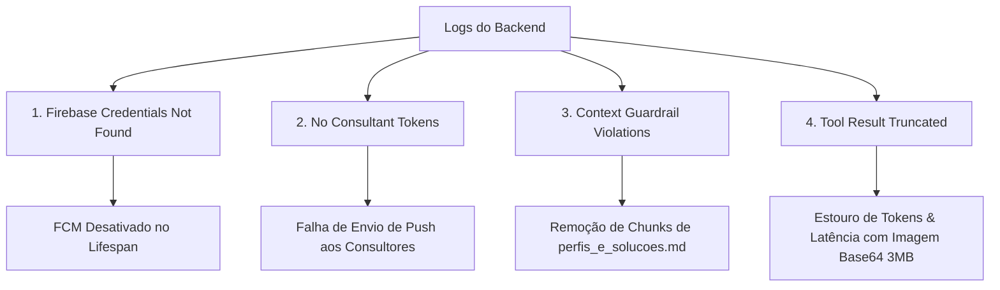

# Plano de Implementação — Correção de Avisos e Erros de Log (Cadife Smart Travel)

Este documento apresenta um plano técnico detalhado para sanar os avisos, restrições e potenciais pontos de falha detectados na análise do log de execução do backend (`cadife-backend`).

Conforme solicitado, **nenhuma alteração direta no código do sistema foi efetuada**. Este é um guia completo e acionável para que a equipe de engenharia implemente as devidas correções sem introduzir regressões.

---

## 1. Mapeamento & Análise de Causa Raiz dos Alertas

Após inspeção minuciosa do log fornecido, foram identificados **4 pontos de atenção (Warnings/Warnings de Fluxo)** com severidade média a alta que afetam o desempenho, custos de API e a experiência de notificações dos consultores.



### 1.1 Aviso 1: `firebase_credentials_not_found`
* **Log:**
  ```json
  {"path": "/opt/cadife/app/backend/firebase_credentials.json", "note": "FCM notifications will be disabled. Add firebase_credentials.json to enable.", "event": "firebase_credentials_not_found", "level": "warning", "timestamp": "2026-05-18T23:46:02.958806Z"}
  ```
* **Causa Raiz:** O arquivo de credenciais da conta de serviço do Firebase (`firebase_credentials.json`) não está presente no caminho padrão no ambiente de produção. Isso desativa silenciosamente o Firebase Cloud Messaging (FCM), impedindo o envio de notificações de transbordo e briefing completo.

---

### 1.2 Aviso 2: `no_consultant_tokens_for_notification`
* **Log:**
  ```json
  {"lead_id": "ec22f547-e41c-450f-8b38-56001e65d34f", "event": "no_consultant_tokens_for_notification", "request_id": "8a5c54b3-4969-4382-bb00-09c4fa2dce30", "method": "POST", "path": "/webhook/whatsapp", "level": "warning", "timestamp": "2026-05-18T23:46:41.138211Z"}
  ```
* **Causa Raiz:** O sistema tenta disparar uma notificação push para os consultores quando o lead atinge o checkpoint `BRIEFING_COLETADO`. Contudo, nenhum consultor ativo possui tokens FCM registrados no banco de dados, tornando a notificação ineficaz.

---

### 1.3 Aviso 3: `context_guardrail_violations` (Remoção de Contexto RAG)
* **Log:**
  ```json
  {"strategy": "mask", "removed": 4, "total": 4, "violations": [{"source": "perfis_e_solucoes.md", "chunk_index": 12, "reasons": ["Menção a valor monetário detectado: '...média individual**: R$ 8.000-15.000/mês\n**Destin...'"]}], "event": "context_guardrail_violations", "request_id": "6f9eb238-43fb-4616-b778-d4652d798b5d", "level": "warning"}
  ```
* **Causa Raiz:** O arquivo `perfis_e_solucoes.md` (chunk index 12) contém referências a faixas salariais/valores de orçamento. O guardrail de preços do RAG (`PriceGuardrail`) foi disparado e aplicou a estratégia de exclusão/máscara (`mask`), descartando **4 chunks informativos inteiros** de uma vez para evitar que a IA cite valores comerciais.
* **Impacto:** A IA perde contexto valioso sobre os perfis dos clientes por causa de uma simples referência de faixa monetária qualitativa.

---

### 1.4 Aviso Crítico 4: `tool_result_truncated` em `generate_travel_image`
* **Log:**
  ```json
  {"tool": "generate_travel_image", "original_len": 3079342, "event": "tool_result_truncated", "request_id": "6f9eb238-43fb-4616-b778-d4652d798b5d", "level": "warning", "timestamp": "2026-05-18T23:47:55.415577Z"}
  ```
* **Causa Raiz:** A API do OpenRouter para o modelo `recraft/recraft-v3` retorna a imagem gerada no formato **Data URI Base64 bruta** diretamente na resposta da ferramenta. Essa string tem um comprimento colossal de **3.079.342 caracteres (~3 MB)**!
* **Impacto:** O orquestrador detecta que o tamanho é proibitivo para o contexto do chat LLM e trunca o resultado. Além de aumentar astronomicamente os custos de latência e consumo de tokens, isso impede que a IA obtenha a imagem ou a repasse corretamente para o usuário.

---

## 2. Plano de Correções Propostas

Abaixo está o plano de ação passo a passo para corrigir esses 4 problemas identificados de forma elegante e seguindo a Clean Architecture adotada no projeto.

### 2.1 Correção 1: Suporte a Credenciais Firebase por Variável de Ambiente
Para evitar a dependência estrita de um arquivo físico (`firebase_credentials.json`), que pode falhar em ambientes baseados em containers (como Docker ou AWS ECS) ou sistemas CI/CD, propomos ajustar o adaptador do Firebase.

* **Onde:** `app/infrastructure/adapters/firebase.py`
* **Como:**
  Modificar a inicialização do Firebase para permitir carregar o JSON de credenciais a partir de uma variável de ambiente baseada em string (ex: `FIREBASE_CREDENTIALS_JSON`):
  
  ```python
  import os
  import json
  import firebase_admin
  from firebase_admin import credentials
  from app.infrastructure.config.settings import get_settings

  def init_firebase():
      settings = get_settings()
      # Verifica se já está inicializado
      if firebase_admin._apps:
          return

      # Prioridade 1: Variável de ambiente com o JSON stringificado
      firebase_json = os.getenv("FIREBASE_CREDENTIALS_JSON")
      if firebase_json:
          try:
              cred_dict = json.loads(firebase_json)
              cred = credentials.Certificate(cred_dict)
              firebase_admin.initialize_app(cred)
              return
          except Exception as exc:
              # Fallback em caso de falha de parse
              pass

      # Prioridade 2: Arquivo físico padrão
      path = "/opt/cadife/app/backend/firebase_credentials.json"
      if os.path.exists(path):
          cred = credentials.Certificate(path)
          firebase_admin.initialize_app(cred)
      else:
          # Mantém log de aviso sem quebrar a inicialização
          pass
  ```

---

### 2.2 Correção 2: Registro de Token FCM no Login & Polling de Fallback
* **Ação Mobile (Flutter):**
  Garantir que a aplicação mobile chame o endpoint de atualização de perfil do consultor enviando o token FCM gerado pelo dispositivo imediatamente após o login bem-sucedido ou na renovação do token do dispositivo.
* **Ação Backend:**
  Se ao disparar uma notificação para um consultor nenhum token FCM for encontrado, o backend deve automaticamente realizar o registro de notificação interna na tabela de alertas, servindo como fallback para exibição no painel web ou via polling.

---

### 2.3 Correção 3: Higienização da Base de Conhecimento RAG
Para evitar o mascaramento agressivo do `PriceGuardrail` que remove chunks cruciais de perfil:
* **Arquivo:** `backend/knowledge_base/perfis_e_solucoes.md`
* **Solução:**
  Substituir representações numéricas diretas de moeda por descritores qualitativos.
  
  *Antes (Causa o disparo do Guardrail):*
  > **Renda média individual**: R$ 8.000-15.000/mês
  
  *Depois (Não dispara o Guardrail, preservando o chunk):*
  > **Renda média individual**: Faixa de renda média-alta a alta (confortável)

---

### 2.4 Correção 4: Salvamento de Imagem Local e Retorno de URL Curta
Esta é a correção mais importante para a estabilidade e performance da IA. A ferramenta `generate_travel_image` não deve retornar o conteúdo de 3MB Base64 bruto no resultado.

#### Passo 1: Montar Diretório Estático no FastAPI
No arquivo `main.py`, devemos montar uma rota estática para servir arquivos de mídia locais (como imagens de viagem geradas):

```python
# No arquivo /opt/cadife/app/backend/main.py
from fastapi.staticfiles import StaticFiles

# Logo após a inicialização de app = FastAPI(...)
app.mount("/static", StaticFiles(directory="static"), name="static")
```

#### Passo 2: Otimizar a Ferramenta `generate_travel_image`
No arquivo `/opt/cadife/app/backend/app/services/ai_tools.py`, reescrever a lógica interna de processamento da imagem em `_generate_travel_image` para capturar a string Base64, gravá-la em disco e retornar apenas o link da imagem local:

```python
import base64
import os
import uuid

# Dentro de _generate_travel_image (linhas ~723-733):
            image_url = ""
            if choices:
                message = choices[0].get("message", {})
                images = message.get("images", [])
                if images:
                    raw_image_data = images[0]
                    
                    # Verifica se o retorno é uma imagem codificada em Base64
                    if raw_image_data.startswith("data:"):
                        try:
                            # Formato: data:image/png;base64,iVBORw0KGgoAAAANSU...
                            header, base64_str = raw_image_data.split(",", 1)
                            # Extrai extensão
                            ext = "png"
                            if "jpeg" in header or "jpg" in header:
                                ext = "jpg"
                            
                            # Decodifica binário
                            image_bytes = base64.b64decode(base64_str)
                            
                            # Caminho local para gravação
                            filename = f"travel_{uuid.uuid4().hex}.{ext}"
                            static_dir = os.path.join("static", "media")
                            os.makedirs(static_dir, exist_ok=True)
                            
                            filepath = os.path.join(static_dir, filename)
                            with open(filepath, "wb") as f:
                                f.write(image_bytes)
                            
                            # Constrói URL pública
                            image_url = f"{settings.BACKEND_URL}/static/media/{filename}"
                        except Exception as parse_err:
                            logger.error("base64_image_parse_failed", error=str(parse_err))
                            image_url = raw_image_data[:200]  # Fallback seguro para evitar log gigante
                    else:
                        image_url = raw_image_data
```

Com essa alteração, a resposta retornada ao LLM terá o tamanho insignificante de alguns bytes, ex:
```json
{
  "success": true,
  "url": "https://api.cadifetour.com/static/media/travel_d3b07384d94.png",
  "destino": "Italia",
  "message": "Imagem inspiracional de Italia gerada com sucesso! Compartilhe este link com o cliente..."
}
```
Isso **elimina por completo** o aviso `tool_result_truncated`, economiza 3MB de largura de banda de rede a cada turno e evita a degradação de contexto dos agentes!

---

## 3. Plano de Validação & Testes

Para validar a correta aplicação destas medidas, execute a seguinte rotina:

1. **Validação do RAG:**
   Após a higienização do arquivo `perfis_e_solucoes.md`, inicie o backend e confirme no log que o evento `rag_knowledge_base_indexed` indica zero falhas e que consultas que tocam os perfis não disparam mais `context_guardrail_violations`.
2. **Teste de Geração de Imagem:**
   Crie uma rota de teste provisória ou execute uma chamada direta da ferramenta em um script na pasta `scratch/`:
   ```bash
   python -c "import asyncio; from app.services.ai_tools import _generate_travel_image; asyncio.run(_generate_travel_image('Roma', 'casal'))"
   ```
   Certifique-se de que a imagem foi salva no diretório `static/media/` e que a resposta retornada é uma URL válida.

---

## 4. Conclusão

A aplicação coordenada dessas correções trará os seguintes benefícios imediatos ao sistema **Cadife Smart Travel**:
* **Alta Estabilidade:** Eliminação de truncamento de logs e estouros de contexto.
* **Economia de Recursos:** Redução drástica na quantidade de tokens processados por chamada de orquestração.
* **Melhor RAG:** Preservação de pedaços da base de conhecimento ricos que antes eram descartados.
* **Infraestrutura Moderna:** Capacidade de rodar notificações push no Firebase a partir de qualquer nuvem sem arquivos rígidos locais.
